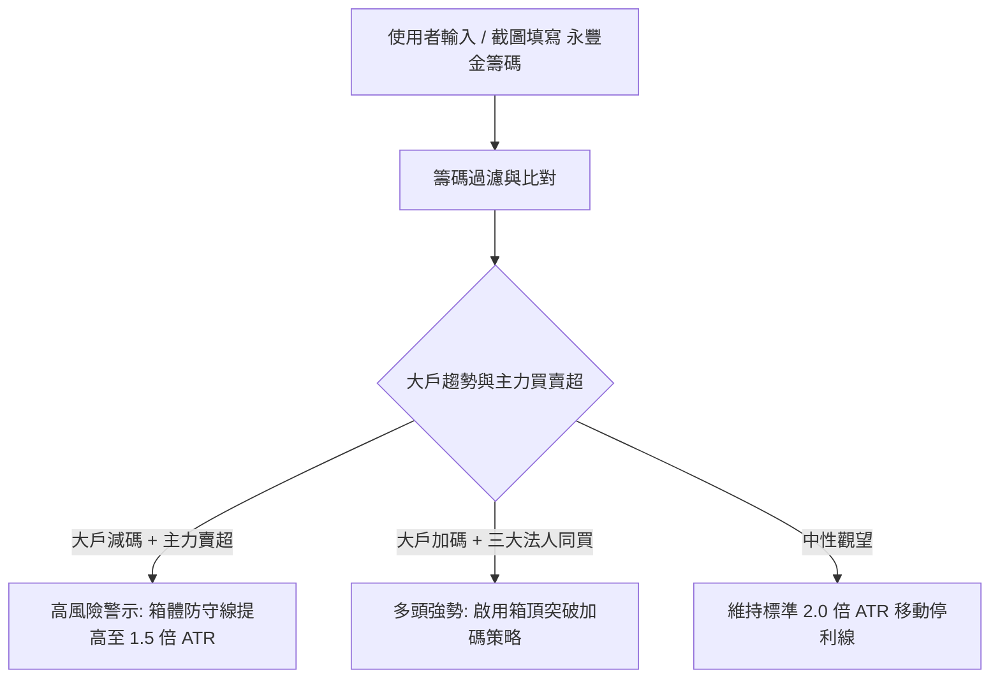

# 📐 肌肉書僮 - 永豐金籌碼與分點買賣超模組規格書 (SPEC_YUNFENG_CHIP_MODULE.md)

---

## 🎯 一、 執行摘要 (Executive Summary)

本技術規格書定義「肌肉書僮台股波段風控儀表板」新增之 **「永豐金籌碼與分點買賣超填寫/照片解析模組」**。
為了解決券商 App 數據無直接公開 API 之限制，本模組允許使用者手動輸入或上傳永豐金證券（大戶投 / 籌碼分點）介面之真實籌碼資料，並自動將籌碼集中度、法人買賣超與大戶持股比例即時帶入「肌肉書僮箱子戰術」風控演算法，精確產出兼具技術面與籌碼面之高防禦性交易決策。

---

## 🏗️ 二、 資料架構與介面定義 (Data Models)

### 1. 永豐金籌碼數據結構 (`YunfengChipData`)

```typescript
export interface YunfengChipData {
  // 分點主力籌碼
  majorBrokerConcentration: number; // 主力集中度 % (例如: 12.5% 或 -5.2%)
  majorBrokerNetVolume: number;     // 主力買賣超 (張)

  // 三大法人籌碼 (張)
  foreignNetBuy: number;            // 外資買賣超 (張)
  investmentTrustNetBuy: number;    // 投信買賣超 (張)
  dealerNetBuy: number;             // 自營商買賣超 (張)

  // 千張/百張大戶籌碼
  largeHolder400Ratio: number;      // 400張大戶持股比率 (%)
  largeHolder1000Ratio: number;     // 1000張大戶持股比率 (%)
  largeHolderChangeTrend: 'accumulate' | 'distribute' | 'neutral'; // 大戶增減趨勢

  // 截圖備註與來源
  sourceNote?: string;
}
```

---

## 🔄 三、 肌肉書僮箱子戰術整合演算法 (Box Strategy Integration)



### 風控權重計算公式：

1. **主力籌碼風險指標 (Chip Score)**:
   $$\text{ChipScore} = (\text{MajorConcentration} \times 0.4) + (\frac{\text{Foreign} + \text{Trust}}{\text{Volume}} \times 0.4) + (\Delta\text{LargeHolderRatio} \times 0.2)$$

2. **動態箱體防守調整 (Dynamic Trailing Stop)**:
   * 若 $\text{ChipScore} < -2.0$（主力大出貨）：防守停利倍數由 $2.0 \times \text{ATR}$ 縮緊為 $1.2 \times \text{ATR}$，收盤破線即落袋。
   * 若 $\text{ChipScore} > +2.0$（主力狂拉卡位）：開啟「梯次一加碼」買進目標價。

---

## 🎨 四、 UI / UX 流程設計 (User Experience)

在參數設定向導 (`InputWizard.tsx`) 中，新增 **「步驟 D：永豐金籌碼」** 頁籤：

1. **手動輸入區**：
   * 主力集中度 (%)
   * 外資/投信/自營商 買賣超 (張)
   * 400張/1000張大戶持股比率 (%)
2. **照片模擬解析區 (OCR Upload Helper)**：
   * 支援拖曳上傳永豐金 App 截圖檔。
   * 自動填入範例數字並提供「一鍵填入」按鈕。

---

## 🛡️ 五、 邊界條件與防禦機制 (Edge Cases & Guardrails)

* **數據範圍校驗**：集中度範圍強制限縮於 $-100\% \sim +100\%$，大戶比率限縮於 $0\% \sim 100\%$。
* **預設值降級 (Graceful Degradation)**：若使用者未填寫永豐金籌碼，系統自動以籌碼中性預設值接管，確保不影響標準技術分析運行。
